# 🛒 سامانه مدیریت هایپرمارکت
## Hypermarket Management System

سامانه جامع مدیریت هایپرمارکت با پشتیبانی کامل از زبان‌های فارسی و انگلیسی

A comprehensive hypermarket management system with full support for Persian and English languages

---

## 📋 فهرست مطالب | Table of Contents

- [معرفی](#معرفی)
- [ویژگی‌ها](#ویژگی‌ها)
- [معماری پایگاه داده](#معماری-پایگاه-داده)
- [نحوه استفاده](#نحوه-استفاده)
  - [ورود به سیستم](#ورود-به-سیستم)
  - [داشبورد](#داشبورد)
  - [مدیریت کالاها](#مدیریت-کالاها)
  - [فروش](#فروش)
  - [مدیریت تامین‌کنندگان](#مدیریت-تامین‌کنندگان)
  - [مدیریت کاربران](#مدیریت-کاربران)
  - [گزارش‌ها](#گزارش‌ها)
  - [تنظیمات](#تنظیمات)
- [نصب و راه‌اندازی](#نصب-و-راه‌اندازی)
- [سازندگان](#سازندگان)

---

## 🎯 معرفی | Introduction

سامانه مدیریت هایپرمارکت یک نرم‌افزار کامل برای مدیریت فروشگاه‌های بزرگ است که امکان مدیریت کالاها، فروش، تامین‌کنندگان، کاربران و گزارش‌گیری را فراهم می‌کند.

The Hypermarket Management System is a complete software solution for managing large retail stores, providing capabilities for product management, sales, suppliers, users, and reporting.

---

## ✨ ویژگی‌ها | Features

- 🌐 پشتیبانی از دو زبان فارسی و انگلیسی
- 📊 داشبورد تحلیلی با نمودارهای تعاملی
- 🏪 مدیریت جامع کالاها و موجودی انبار
- 💰 سیستم فروش پیشرفته با امکان صدور فاکتور
- 👥 مدیریت تامین‌کنندگان و سفارشات
- 🔐 سیستم کاربری با سطوح دسترسی مختلف
- 📈 گزارش‌های مالی و عملکردی دقیق
- 🎨 رابط کاربری مدرن و کاربرپسند

---

## 🗄️ معماری پایگاه داده | Database Architecture

سیستم از یک پایگاه داده رابطه‌ای با معماری نرمال شده استفاده می‌کند که شامل جداول اصلی زیر است:

The system uses a normalized relational database architecture that includes the following main tables:

### نمودار ER | ER Diagram

**نمودار رابطه‌ای موجودیت‌ها | Entity Relationship Diagram:**

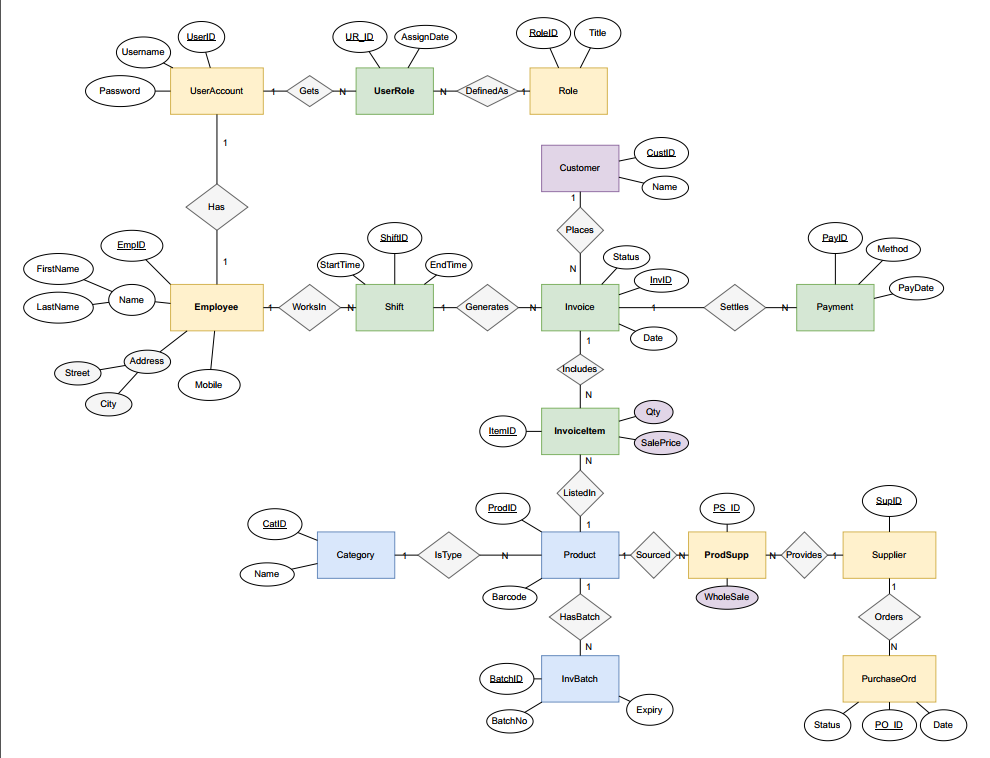

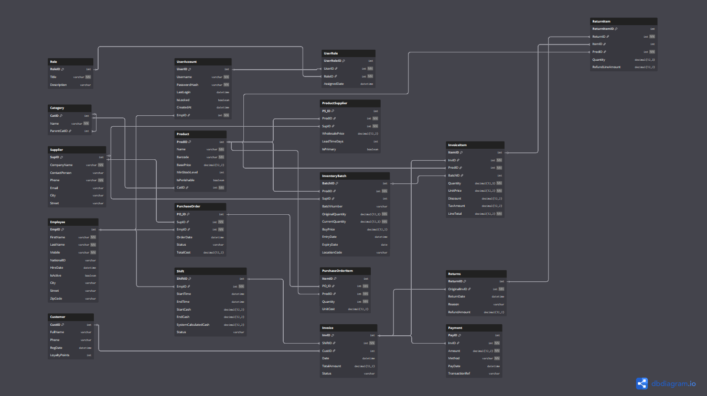

### جداول اصلی | Main Tables

#### 👤 مدیریت کاربران | User Management
- **UserAccount**: اطلاعات حساب کاربری شامل نام کاربری، رمز عبور، تاریخ ورود و ایمیل
- **Role**: نقش‌های سیستم (مدیر، فروشنده، انبار‌دار و غیره)
- **UserRole**: ارتباط بین کاربران و نقش‌ها (رابطه چند به چند)
- **Employee**: اطلاعات کارمندان شامل نام، نام خانوادگی، موبایل، آدرس و شهر

#### 🏪 مدیریت محصولات | Product Management
- **Product**: اطلاعات محصولات شامل بارکد، نام، قیمت خرید، قیمت فروش و قیمت عمده‌فروشی
- **Category**: دسته‌بندی محصولات
- **InvBatch**: دسته‌های موجودی انبار با شماره دسته و تاریخ انقضا
- **InventoryBatch**: جزئیات موجودی هر دسته شامل تعداد، قیمت خرید، تاریخ ورود و کد مکان

#### 🤝 مدیریت تامین‌کنندگان | Supplier Management
- **Supplier**: اطلاعات تامین‌کنندگان شامل نام شرکت، شخص تماس، ایمیل، شماره تلفن، آدرس و شهر
- **ProdSupp**: ارتباط بین محصولات و تامین‌کنندگان (رابطه چند به چند)
- **PurchaseOrder**: سفارشات خرید با وضعیت، شماره سفارش و تاریخ

#### 💰 مدیریت فروش | Sales Management
- **Invoice**: فاکتورهای فروش شامل شماره فاکتور، تاریخ، وضعیت و شماره صورت‌حساب
- **InvoiceItem**: اقلام فاکتور با تعداد، قیمت فروش و قیمت خرید
- **Payment**: پرداخت‌ها با روش پرداخت، مبلغ، شماره کارت و شماره تراکنش
- **Customer**: اطلاعات مشتریان شامل نام و امتیازات وفاداری

#### 💼 مدیریت نوبت‌کاری | Shift Management
- **Shift**: نوبت‌های کاری کارمندان با زمان شروع و پایان

#### 📦 مدیریت بازگشت کالا | Returns Management
- **Returns**: بازگشت کالاها با تاریخ، دلیل، مبلغ بازپرداخت و وضعیت

### روابط کلیدی | Key Relationships

**رابطه یک به چند | One-to-Many:**
- هر کاربر می‌تواند چندین نوبت کاری داشته باشد
- هر کارمند می‌تواند چندین فاکتور صادر کند
- هر فاکتور می‌تواند چندین قلم کالا داشته باشد
- هر محصول می‌تواند در چندین دسته موجودی باشد
- هر مشتری می‌تواند چندین سفارش داشته باشد

**رابطه چند به چند | Many-to-Many:**
- کاربران و نقش‌ها (از طریق جدول UserRole)
- محصولات و تامین‌کنندگان (از طریق جدول ProdSupp)
- فاکتورها و محصولات (از طریق جدول InvoiceItem)

### ویژگی‌های طراحی | Design Features

✅ **نرمال‌سازی**: پایگاه داده تا فرم نرمال سوم (3NF) نرمال شده است  
✅ **یکپارچگی ارجاعی**: استفاده از کلیدهای خارجی برای حفظ یکپارچگی داده‌ها  
✅ **مقیاس‌پذیری**: طراحی به گونه‌ای که امکان افزودن جداول و روابط جدید وجود دارد  
✅ **بهینه‌سازی**: استفاده از ایندکس‌ها برای بهبود عملکرد کوئری‌ها  
✅ **انعطاف‌پذیری**: پشتیبانی از روابط چند به چند برای گسترش آینده

---

## 📖 نحوه استفاده | User Guide

### 🔑 ورود به سیستم | Login

برای ورود به سیستم، نام کاربری و رمز عبور خود را وارد کنید.

To log in to the system, enter your username and password.

**نمای فارسی | Persian View:**
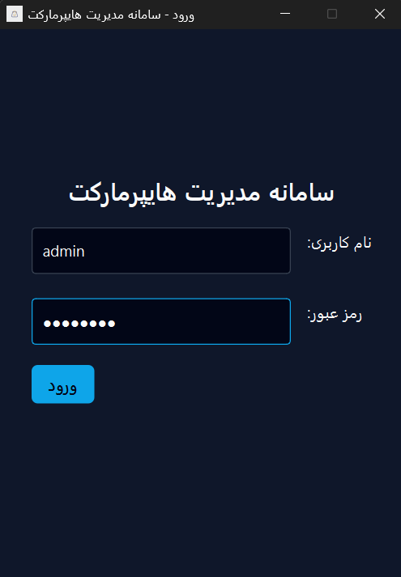

**نمای انگلیسی | English View:**
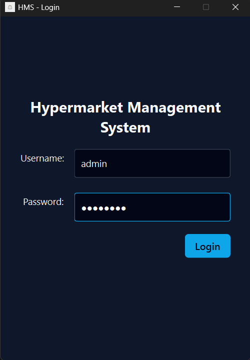

---

### 📊 داشبورد | Dashboard

پس از ورود به سیستم، داشبورد اصلی شامل اطلاعات کلیدی زیر نمایش داده می‌شود:

After logging in, the main dashboard displays the following key information:

- فروش امروز | Today's Sales
- سود امروز | Today's Profit  
- کالاهای رو به اتمام | Low Stock Items
- سفارش‌های امروز | Today's Orders
- نمودار فروش روزانه | Daily Sales Chart

**نمای فارسی | Persian View:**
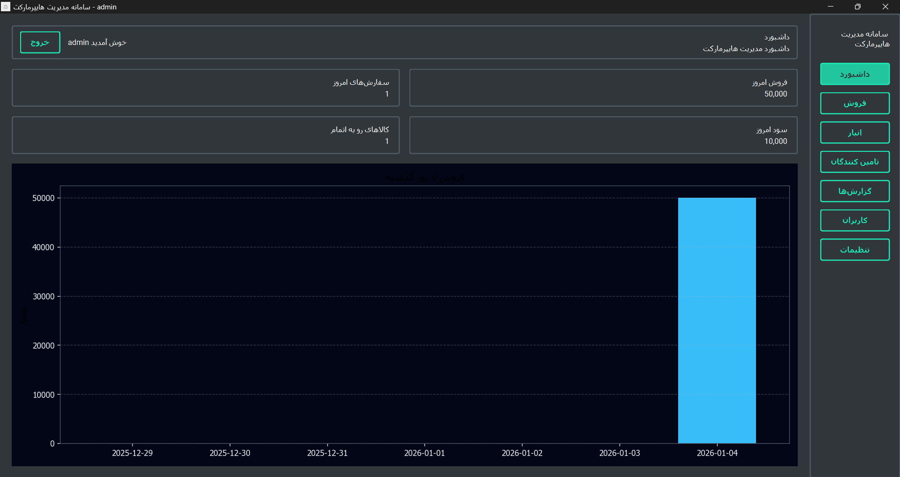

**نمای انگلیسی | English View:**
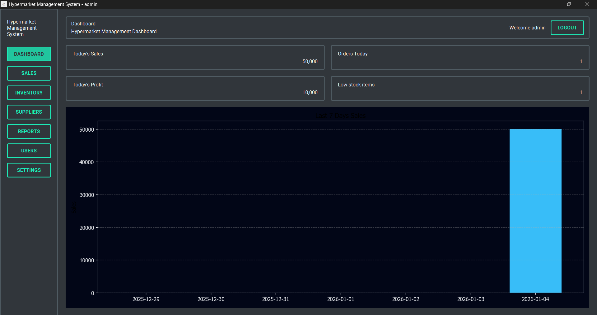

---

### 📦 مدیریت کالاها | Product Management

در این بخش می‌توانید:

In this section you can:

- لیست تمام کالاها را مشاهده کنید
- کالای جدید اضافه کنید
- اطلاعات کالا را ویرایش کنید
- موجودی انبار را مدیریت کنید
- گزارش موجودی را دریافت کنید

اطلاعات نمایش داده شده شامل:
- بارکد | Barcode
- دسته‌بندی | Category
- قیمت ثابت | Fixed Price
- تعداد | Quantity
- جدول موجودی | Inventory Table

**نمای فارسی | Persian View:**
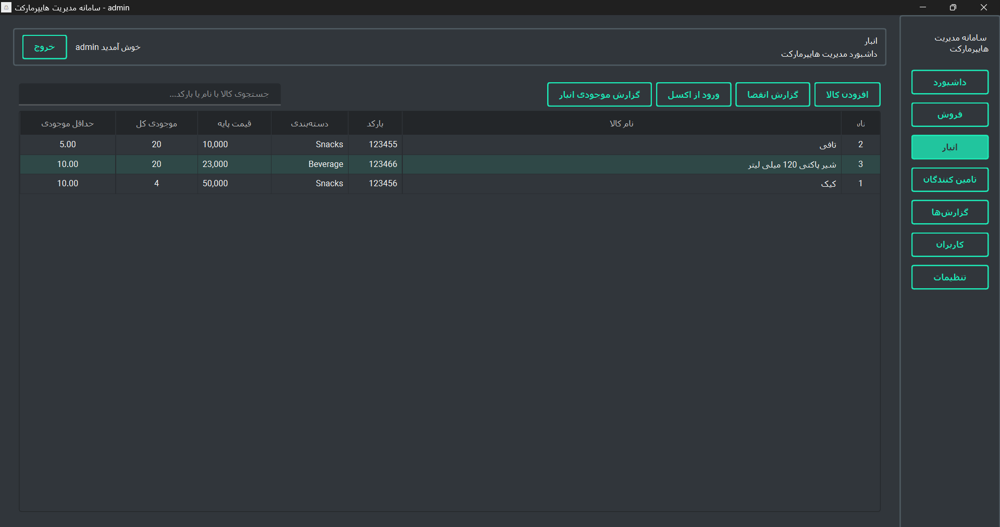

**نمای انگلیسی | English View:**
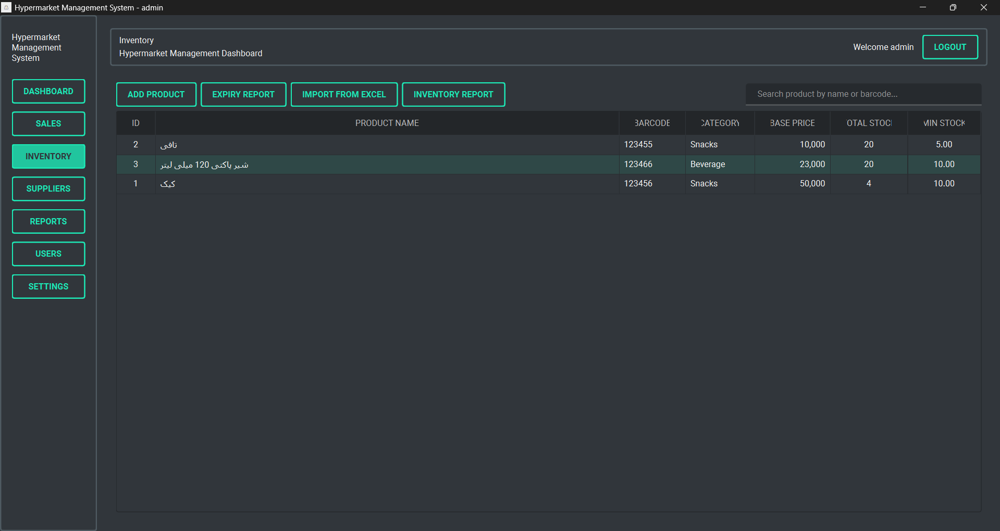

#### افزودن کالا | Add Product

برای افزودن کالای جدید روی دکمه "افزودن کالا" کلیک کنید و فرم زیر را پر کنید:

To add a new product, click the "Add Product" button and fill in the following form:

- نام کالا | Product Name
- بارکد | Barcode
- قیمت | Price
- موجودی | Stock
- دسته‌بندی | Category

---

### 💳 فروش | Sales

صفحه فروش به شما امکان می‌دهد:

The sales page allows you to:

- جستجوی سریع کالا با بارکد یا نام | Quick product search by barcode or name
- افزودن کالا به سبد خرید | Add products to cart
- اعمال تخفیف | Apply discounts
- انتخاب روش پرداخت | Select payment method
- صدور فاکتور | Issue invoice
- دریافت فاکتور | Print receipt

اطلاعات نمایش داده شده:
- لیست کالاهای انتخابی با تعداد و قیمت | Selected items with quantity and price
- مجموع کل | Total Amount
- تخفیف | Discount
- قابل پرداخت | Payable Amount

عملیات موجود:
- تسویه | Checkout
- فراخوانی فاکتور | Recall Invoice
- نگه داشتن فاکتور | Hold Invoice
- حذف همه | Clear All
- نشان سیف | Print Bill

**نمای فارسی | Persian View:**
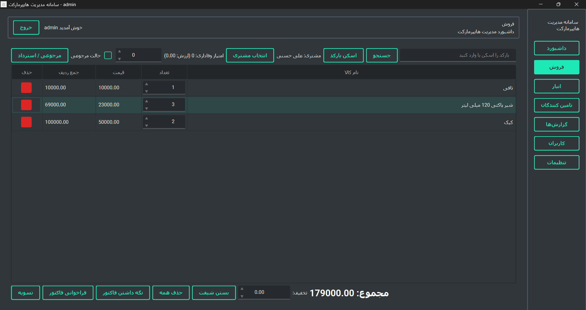

**نمای انگلیسی | English View:**
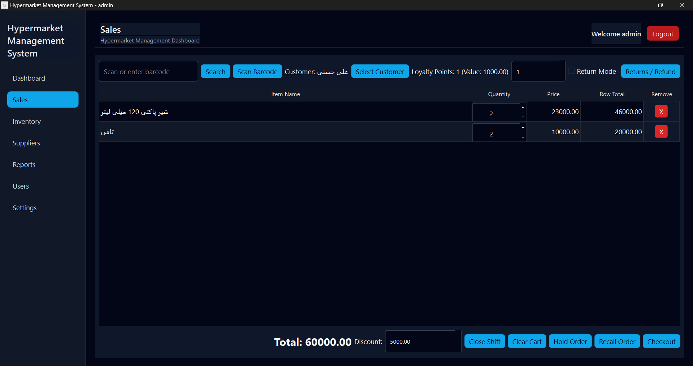

---

### 🏭 مدیریت تامین‌کنندگان | Supplier Management

در این بخش می‌توانید:

In this section you can:

- لیست تامین‌کنندگان را مشاهده کنید | View suppliers list
- تامین‌کننده جدید اضافه کنید | Add new supplier
- اطلاعات تامین‌کننده را ویرایش کنید | Edit supplier information

اطلاعات تامین‌کننده شامل:
- شناسه | ID
- نام شرکت | Company Name
- نام مسئول | Contact Person
- تلفن | Phone
- آدرس | Address

**نمای فارسی | Persian View:**
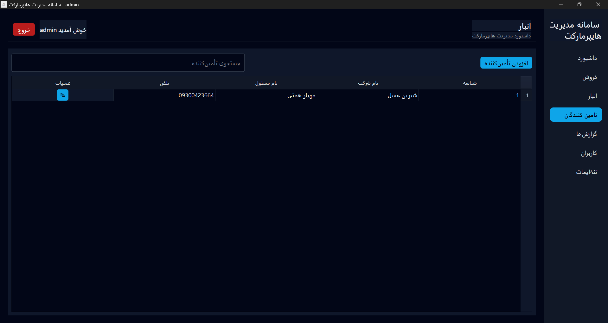

**نمای انگلیسی | English View:**
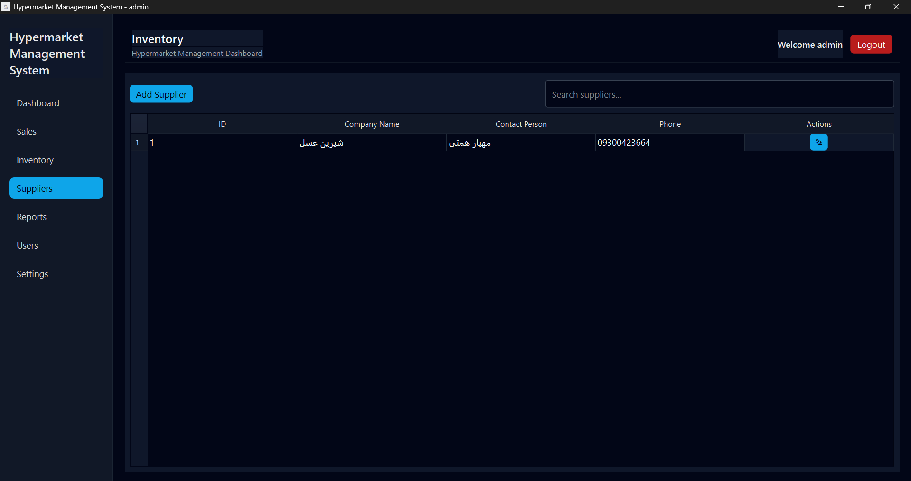

---

### 👤 مدیریت کاربران | User Management

مدیریت کاربران شامل موارد زیر است:

User management includes:

- مشاهده لیست کاربران | View users list
- افزودن کاربر جدید | Add new user
- ویرایش اطلاعات کاربر | Edit user information
- حذف کاربر | Delete user

اطلاعات کاربر:
- نام کاربری | Username
- نقش | Role
- نام و نام خانوادگی | Full Name
- وضعیت | Status

**نمای فارسی | Persian View:**
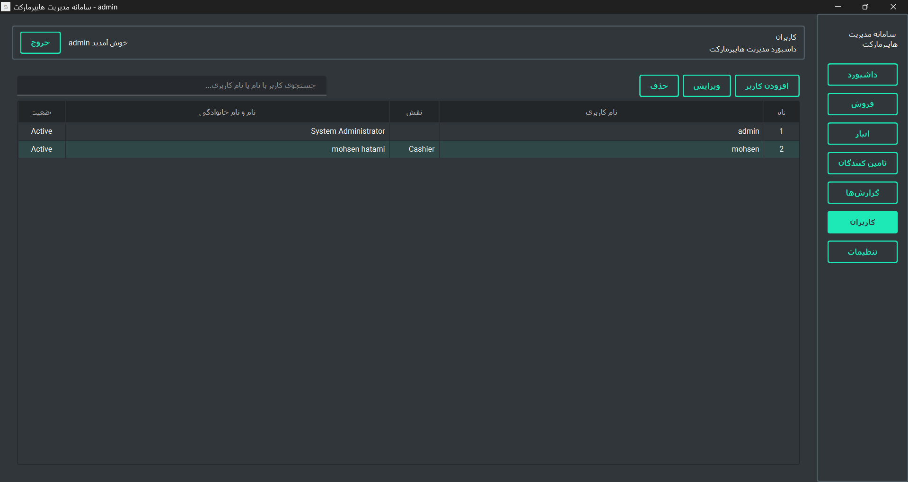

**نمای انگلیسی | English View:**
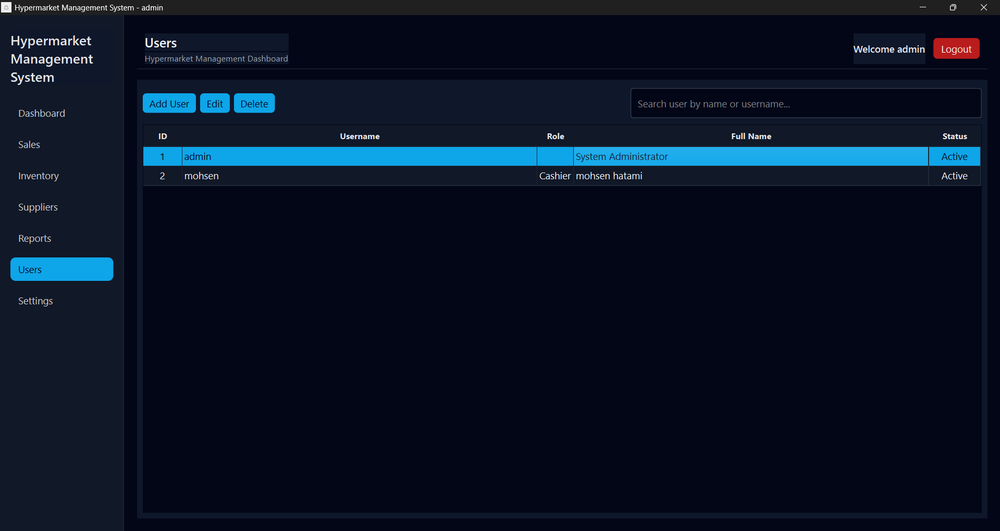

---

### 📈 گزارش‌ها | Reports

بخش گزارش‌ها امکانات زیر را ارائه می‌دهد:

The reports section provides:

- گزارش فروش روزانه | Daily sales report
- نمودار فروش | Sales chart
- فیلتر بر اساس تاریخ | Filter by date
- جزئیات تراکنش‌ها | Transaction details
- خروجی CSV | CSV export

اطلاعات نمایش داده شده:
- تاریخ | Date
- مشتری | Customer
- مبلغ کل | Total Amount
- تخفیف | Discount
- تعداد تراکنش‌ها | Number of Transactions
- سود کل | Total Profit
- مجموع فروش | Total Sales

**نمای فارسی | Persian View:**


**نمای انگلیسی | English View:**
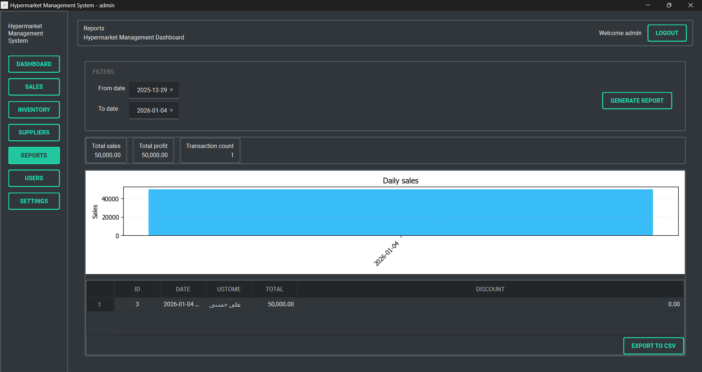

---

### ⚙️ تنظیمات | Settings

در بخش تنظیمات می‌توانید:

In the settings section you can:

**پروفایل | Profile:**
- مشاهده و ویرایش اطلاعات حساب کاربری | View and edit account information
- نام | Name
- نام خانوادگی | Surname
- کد ملی | National ID
- نام کاربری | Username

**تغییر رمز عبور | Change Password:**
- تغییر رمز عبور حساب | Change account password
- رمز عبور فعلی | Current Password
- رمز عبور جدید | New Password
- تکرار رمز عبور جدید | Confirm New Password

**زبان | Language:**
- انتخاب زبان برنامه (فارسی/انگلیسی) | Select application language (Persian/English)

**اطلاعات فروشگاه | Store Information:**
- نام فروشگاه | Store Name
- آدرس | Address
- تلفن | Phone

**نمای ظاهری | Appearance:**
- انتخاب پوسته | Theme Selection
- اندازه قلم | Font Size

**نمای فارسی | Persian View:**
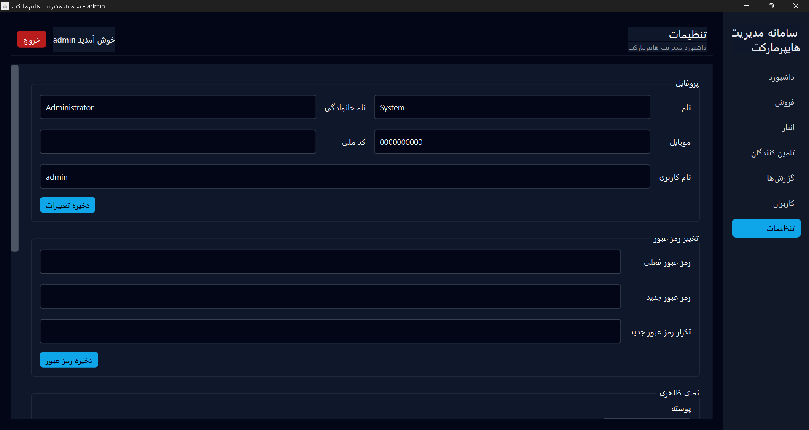
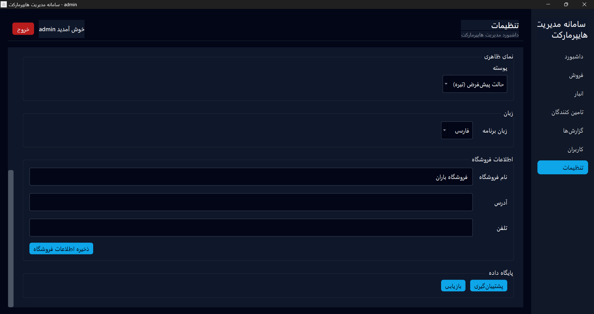

**نمای انگلیسی | English View:**
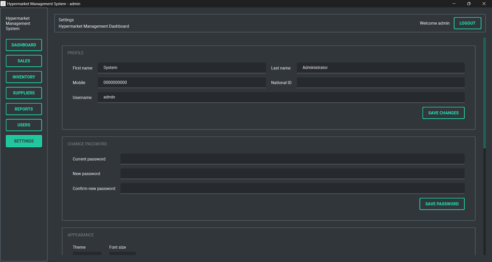
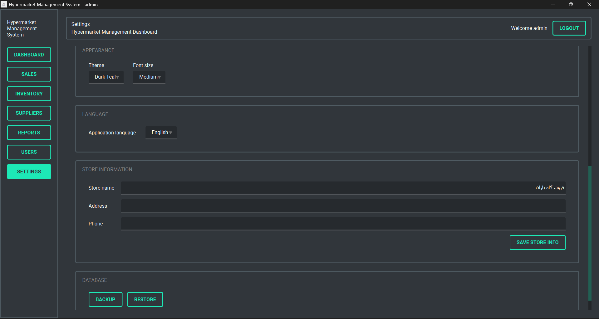

---

## 🚀 نصب و راه‌اندازی | Installation

```bash
# کلون کردن پروژه | Clone the project
git clone https://github.com/Pezhm4n/hypermarket_management_system.git

# نصب وابستگی‌ها | Install dependencies
pip install -r requirements.txt

# اجرای برنامه | Run the application
python main.py
```

---

## 👥 سازندگان | Developers

این پروژه توسط تیمی متشکل از دو نفر توسعه داده شده است.

This project was developed by a team of two developers.

---

## 📄 مجوز | License

این پروژه تحت مجوز MIT منتشر شده است.

This project is released under the MIT License.

---

## 🤝 مشارکت | Contributing

از مشارکت شما در بهبود این پروژه استقبال می‌کنیم!

We welcome your contributions to improve this project!

---

## 📧 تماس | Contact

برای گزارش مشکلات یا پیشنهادات از بخش Issues گیت‌هاب استفاده کنید.

For reporting issues or suggestions, please use the GitHub Issues section.
