# Hypermarket Management System Guide

## Table of Contents
- [Introduction](#introduction)
- [System Login](#system-login)
- [Dashboard](#dashboard)
- [Inventory Management](#inventory-management)
- [Supplier Management](#supplier-management)
- [Sales](#sales)
- [Customers](#customers)
- [Reports](#reports)
- [Users](#users)
- [Settings](#settings)

---

## Introduction

The Hypermarket Management System is a comprehensive software solution for managing large retail stores, offering the following features:

- Inventory and stock management
- Point of sale system with barcode support
- Supplier and customer management
- Advanced reporting
- Bilingual support (Persian and English)
- Customer loyalty points system
- User management and access levels

---

## System Login

To log into the system:
1. Enter your username
2. Enter your password
3. Click the "Login" button

**Default User:**
- Username: `admin`
- Password: (the password you set during installation)

---

## Dashboard

The dashboard displays key information at a glance:

### Information Cards
- **Today's Sales**: Total sales for the current day
- **Today's Profit**: Calculated net profit for today
- **Orders Today**: Number of sales transactions today
- **Low Stock Items**: Number of products that have reached minimum stock level

### Daily Sales Chart
A bar chart at the bottom of the dashboard shows the sales trend over different days.

---

## Inventory Management

### View Product List

On this page you can:
- View the list of all products
- Search for specific products
- View information including: barcode, category, base price, total stock, and minimum stock

### Add New Product

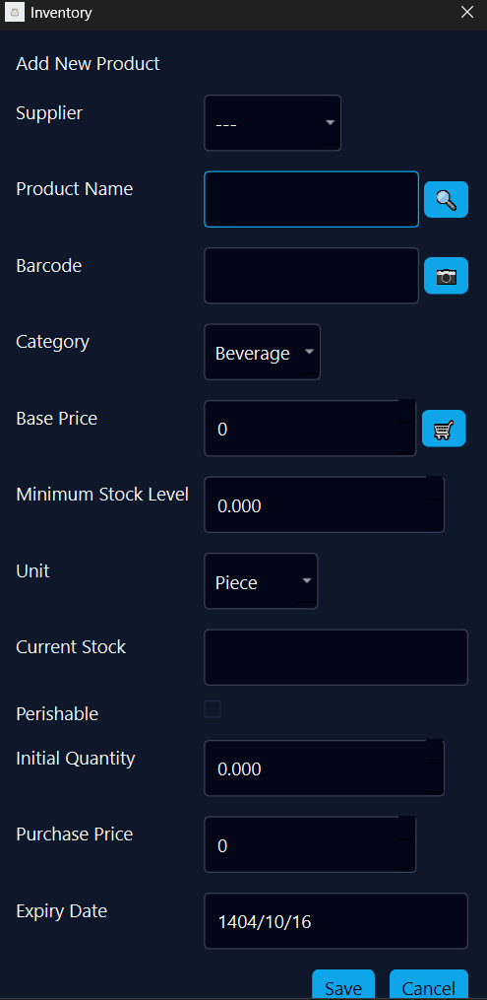

To add a new product:

1. Click the **"Add Product"** button
2. Complete the following form:

**Basic Information:**
- **Supplier**: Select the supplier from the dropdown list
- **Product Name**: Enter the product name
  - You can click the search icon to retrieve the original product name based on the barcode
- **Barcode**: Enter the product barcode
  - You can click the camera icon to scan the barcode

**Category and Pricing:**
- **Category**: Select the product category (Beverage, Snacks, etc.)
- **Base Price (Rial)**: Purchase price from the supplier
  - By clicking the shopping cart icon, the actual and updated product price is retrieved from the Torob website
- **Minimum Stock Level**: Warning threshold for inventory
- **Unit**: Unit of measurement (Piece, Kilogram, etc.)

**Stock Information:**
- **Current Stock**: Initial product inventory
- **Is Perishable?**: Check if the product is perishable
- **Initial Quantity**: Initial quantity for warehouse entry
- **Purchase Price (Rial)**: Actual purchase price for this batch
- **Expiry Date (Shamsi)**: Product expiration date (if perishable)

3. Click **"Cancel"** or **"Save"**

### Product Operations

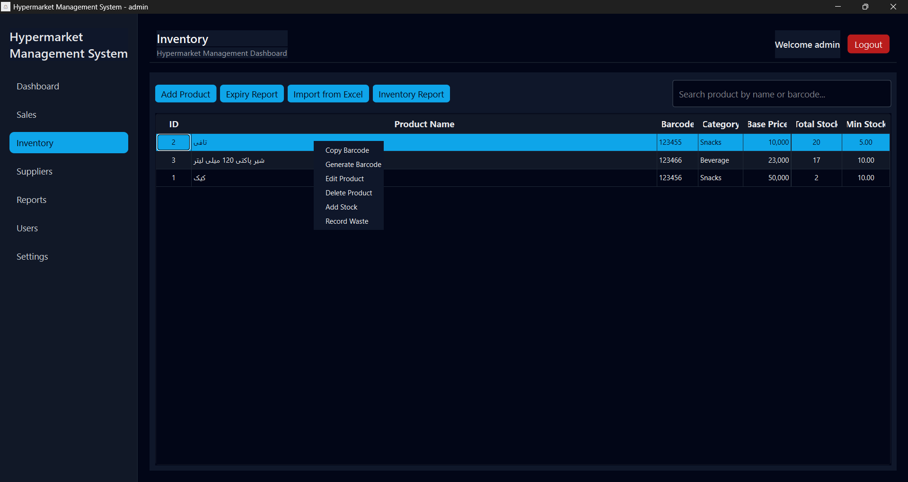

Right-click on any product to display the following menu:

- **Copy Barcode**: Copy the product barcode
- **Generate Barcode**: Create and print barcode label
- **Edit Product**: Edit product information
- **Delete Product**: Remove product from the system
- **Add Stock**: Increase warehouse inventory
- **Record Waste**: Record damaged or spoiled products

### Products Near Expiry Report

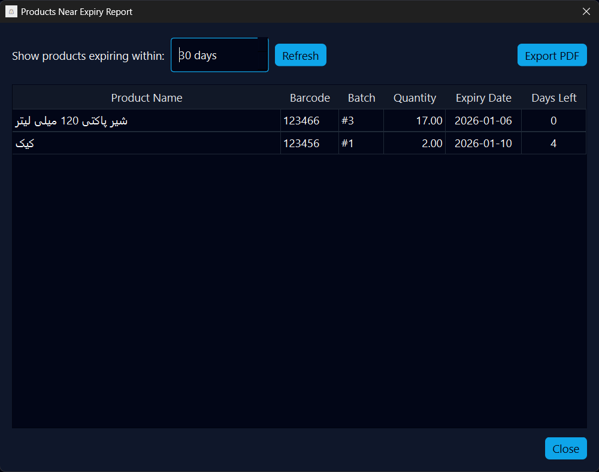

This report shows products that are approaching their expiration date:

- You can set the time range (e.g., 30 days)
- Click **"Refresh"** to update the list
- Information includes: product name, barcode, batch number, quantity, expiry date, and days remaining
- You can export the report as a PDF

### Inventory Stock Report

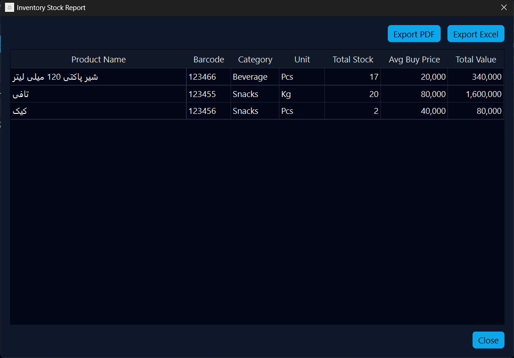

This report displays complete inventory information:

- **Product Name**: Name of the product
- **Barcode**: Barcode number
- **Category**: Product category
- **Unit**: Unit of measurement
- **Total Stock**: Quantity in stock
- **Avg Buy Price**: Average purchase price of the product
- **Total Value**: Total inventory value (quantity × average price)

You can export the report in **PDF** or **Excel** format.

---

## Supplier Management

### View Supplier List

On this page you can:
- View the list of all suppliers
- Search for suppliers
- View information including: company name, contact person, and phone number

### Add New Supplier

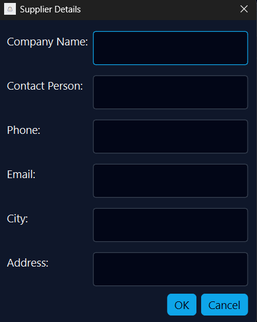

To add a supplier:

Click the **"Add Supplier"** button and enter the following information:
   - **Company Name**: Supplier company name
   - **Contact Person**: Name of the responsible person
   - **Phone**: Contact number
   - **Email**: Email address
   - **City**: Company location city
   - **Address**: Complete address

Click **"OK"** to save

---

## Sales

The sales screen provides the following features:

### Add Product to Cart

There are several methods to add products:

1. **Enter Barcode**: Type the barcode in the search box and press Enter
2. **Scan Barcode**: Click the **"Scan Barcode"** button and scan the barcode
3. **Search**: Click the **"Search"** button and select the product from the list

### Customer Management

- **Select Customer**: Click the **"Select Customer"** button
- **Loyalty Points**: Customer points and their value are displayed at the top
- Example: `Loyalty Points: 1 (Value: 1000.00)`

### Sales Operations

**Available Buttons:**
- **Returns / Refund**: Return items from customer
- **Return Mode**: Activate return mode
- **Search**: Search for products in the list
- **Scan Barcode**: Scan product barcodes

### Shopping Cart Details

The shopping cart table includes:
- **Item Name**: Product name
- **Quantity**: Adjustable with + and - buttons
- **Price**: Unit price
- **Row Total**: Total price for each row
- **Remove**: Remove product from cart (red X button)

### Complete Sale

At the bottom of the page:
- **Discount**: Enter discount amount
- **Total**: Display total purchase amount
- **Operation Buttons**:
  - **Close Shift**: Temporarily save invoice
  - **Recall Order**: Retrieve saved invoices
  - **Hold Order**: Save current invoice
  - **Clear Cart**: Clear shopping cart
  - **Close Shift**: Close work shift and generate report
  - **Checkout**: Finalize purchase

### Barcode Scanning

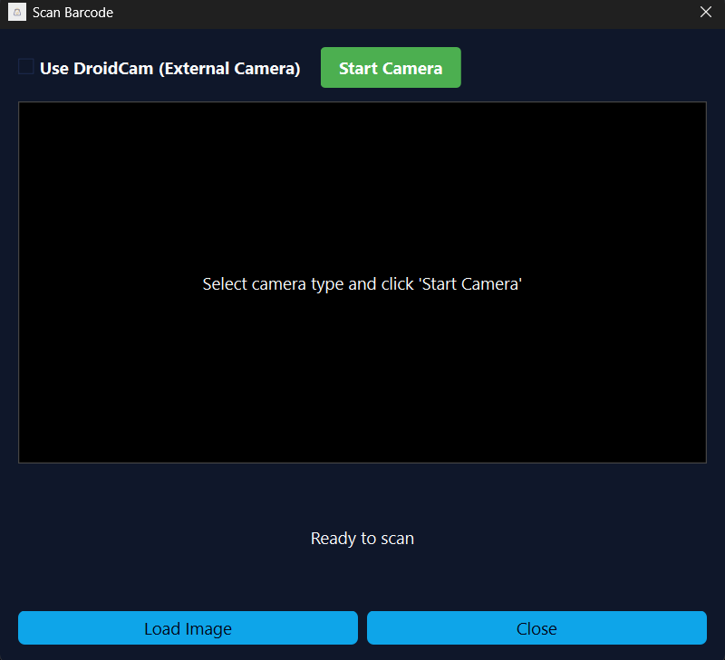

To scan a barcode:
1. Select camera type (built-in or DroidCam for mobile)
2. Click **"Start Camera"**
3. Place the barcode in front of the camera
4. The system automatically recognizes the barcode

You can also use **"Load Image"** to upload a barcode image.

### Product Returns

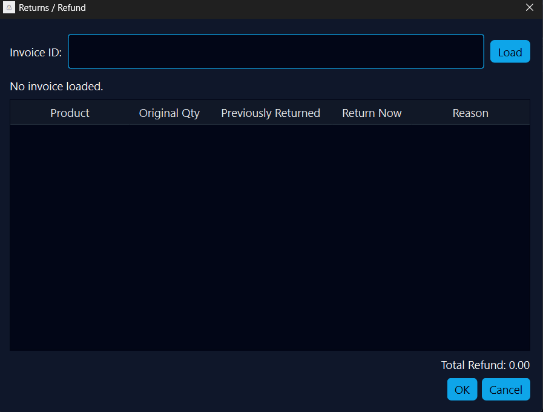

To return items:
1. Enter the invoice ID in the **"Invoice ID"** box
2. Click **"Load"**
3. Invoice details and products are displayed
4. Enter the return quantity and reason for each product
5. The refund amount is shown at the bottom
6. Click **"OK"** to confirm or **"Cancel"** to cancel

---

## Customers

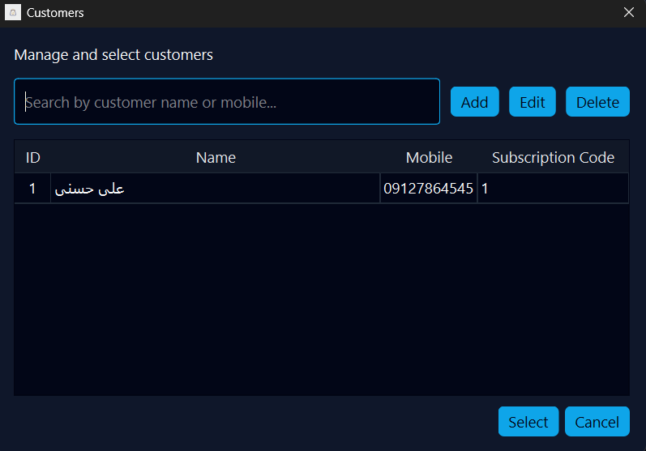

In this section you can:

### View and Search
- View the list of all customers
- Search by name or mobile number
- View each customer's subscription code

### Customer Management
- **Add**: Add new customer
- **Edit**: Edit customer information
- **Delete**: Remove customer from system

### Select Customer
- Click on a customer and then click **"Select"**
- Or click **"Cancel"** to go back

**Customer information includes:**
- ID
- Name
- Mobile number
- Subscription Code (for loyalty points)

---

## Reports

The reports section provides comprehensive analytical information:

### Time Filters
- **From date**: Report range start date
- **To date**: Report range end date
- Click **"Generate report"**

### Overall Statistics
Three information cards are displayed at the top:
- **Total sales**: Total sales in the selected period
- **Total profit**: Calculated net profit
- **Transaction count**: Number of invoices issued

### Daily Sales Chart
A bar chart shows the sales trend over different days.

### Transaction Table
List of all sales transactions including:
- **ID**: Invoice number
- **Date**: Sales date and time
- **Customer**: Customer name
- **Total**: Total invoice amount
- **Discount**: Discount amount given

### Export Report
Click **"Export to CSV"** to download the report in CSV format.

---

## Users

### View Users
List of all system users with information:
- **Username**
- **Role**: System Administrator, Cashier, etc.
- **Full Name**
- **Status**: Active or Inactive

### User Management
- **Add User**: Add new user
- **Edit**: Edit user information
- **Delete**: Remove user from system
- **Search**: Search by name or username

### Add New User

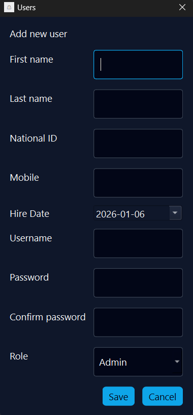

To create a new user:

Click **"Add User"** and complete the following form:
   - **First name**: User's first name
   - **Last name**: User's last name
   - **National ID**: User's national ID
   - **Mobile**: Contact number
   - **Hire Date**: Start date
   - **Username**: Username for system login
   - **Password**: User password
   - **Confirm password**: Password confirmation
   - **Role**: User role (Admin or Cashier)

Click **"Save"**

**Note**: Users with the "Cashier" role only have access to the sales section.

**Note**: Users with the "Warehouse Manager" role only have access to the inventory section.

---

## Settings

Settings are divided into three main sections:

### User Profile

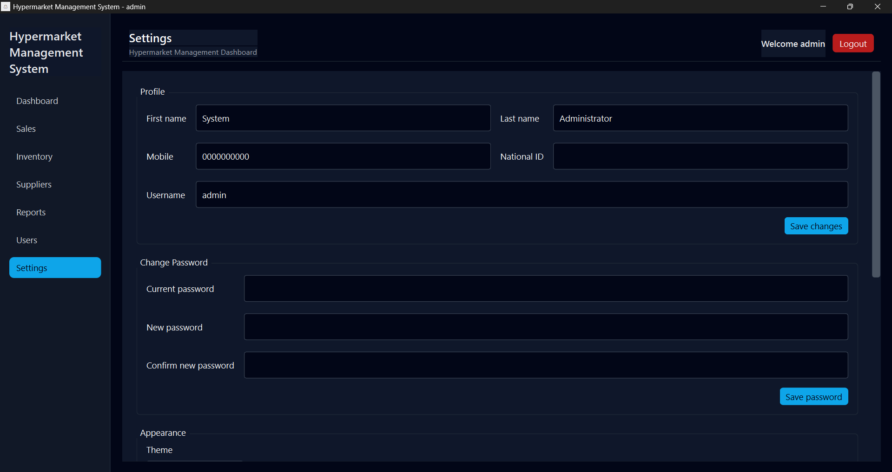

**Personal Information:**
- First name
- Last name
- Mobile
- National ID
- Username

Click **"Save changes"** to apply changes.

**Change Password:**
- Enter current password
- Enter new password
- Repeat new password
- Click **"Save password"**

### Appearance and Language

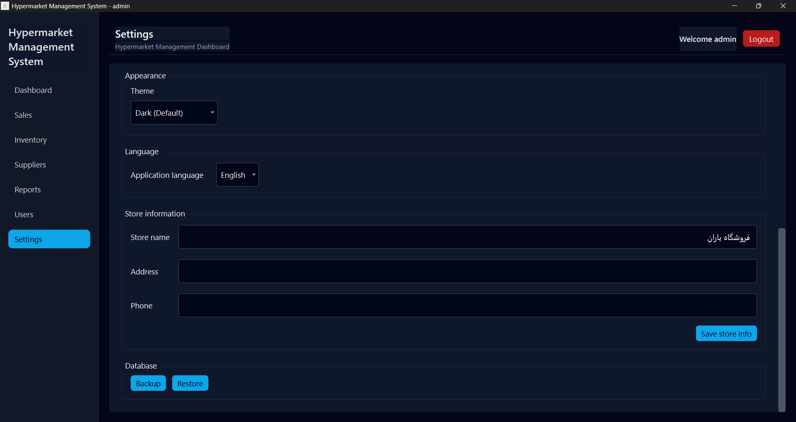

**Application Theme:**
- Choose between dark theme (default) or light theme

**Application Language:**
- **Application language**: Choose between Persian or English

**Store Information:**
- **Store name**: Hypermarket name
- **Address**: Complete store address
- **Phone**: Store contact number

Click **"Save store info"**.

### Database

In the Database section you can:
- **Backup**: Back up the database
- **Restore**: Restore database from backup file

**Important Note**: Regularly back up your database so you can restore your data in case of problems.

---

## Frequently Asked Questions

### How do I find products with low stock?
On the dashboard, the "Low stock Items" card shows the number of products that have reached minimum stock level.

### How can I return a previous invoice?
From the sales page, click **"Returns / Refund"** and enter the invoice number.

### Can I hold multiple invoices simultaneously?
Yes, using the **"Hold Order"** button you can save invoices and later retrieve them with **"Recall Order"**.

### How do I give points to customers?
By selecting a customer on the sales page, the system automatically awards points based on the purchase amount.

### Can I print reports?
Yes, all reports can be exported to PDF or Excel.

---

## Support

If you encounter problems or need further assistance:
- Contact the development team on GitHub
- Create a new issue in the project repository

---

**Guide Version:** 1.0  
**Last Updated:** January 6, 2026
