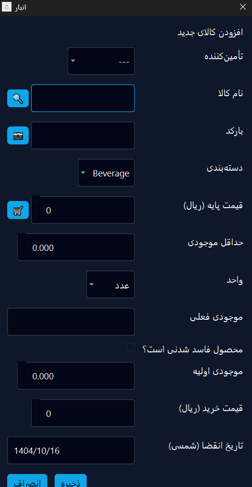
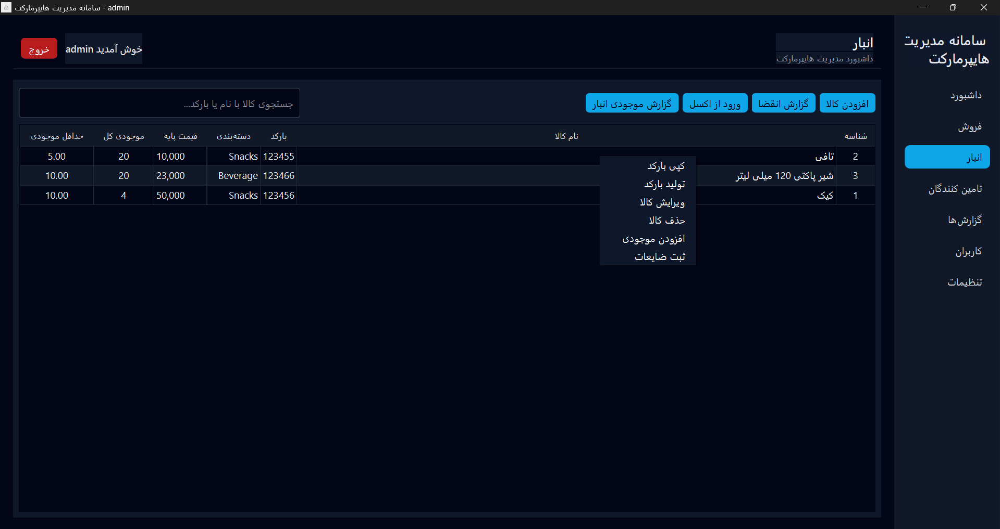
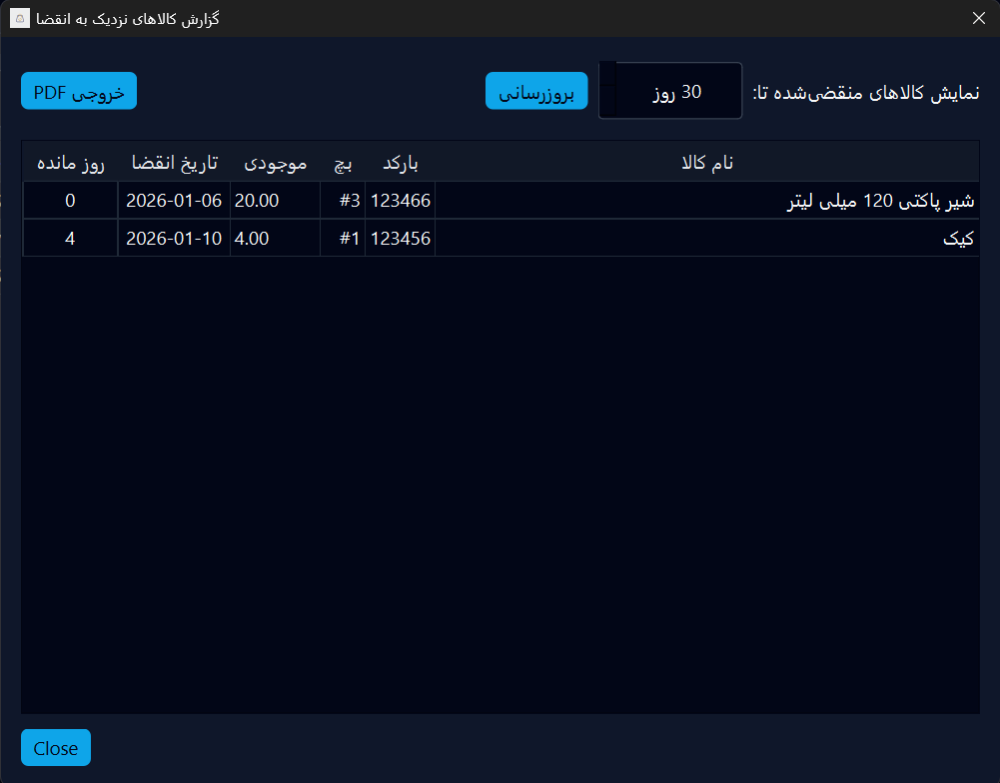
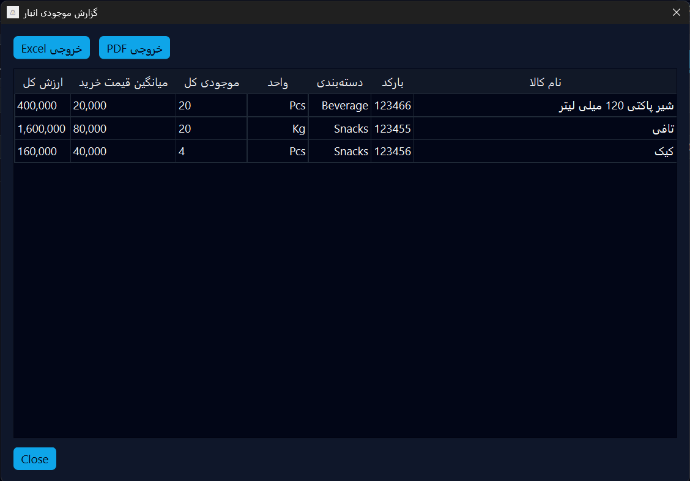
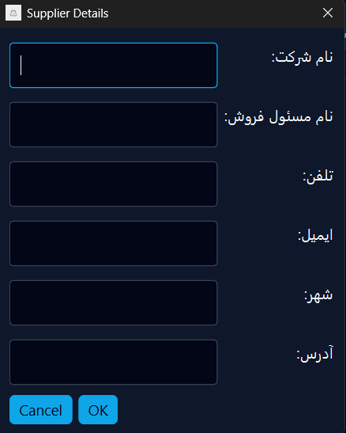
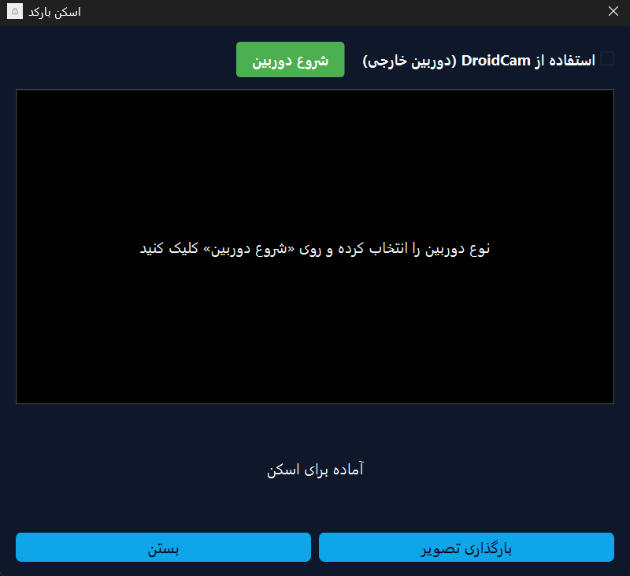
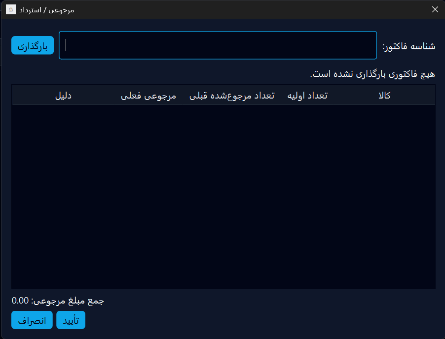
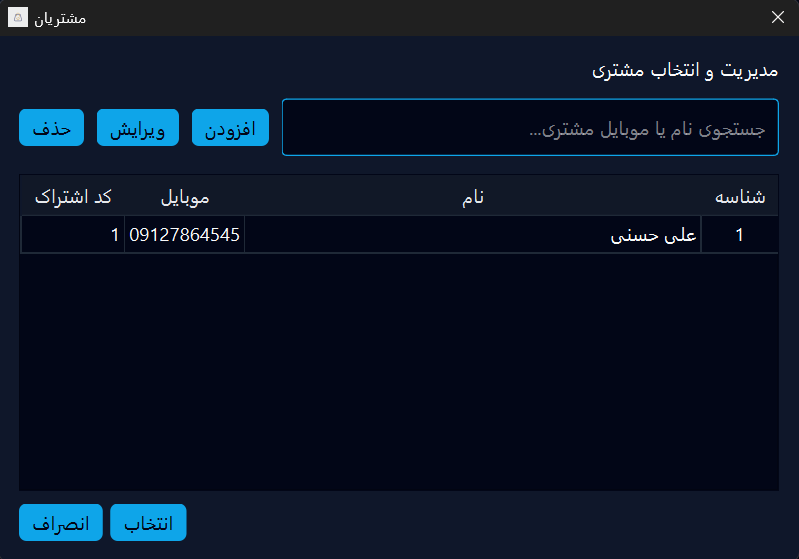
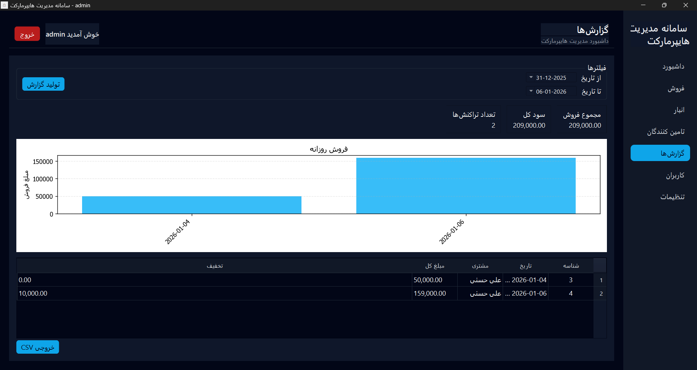
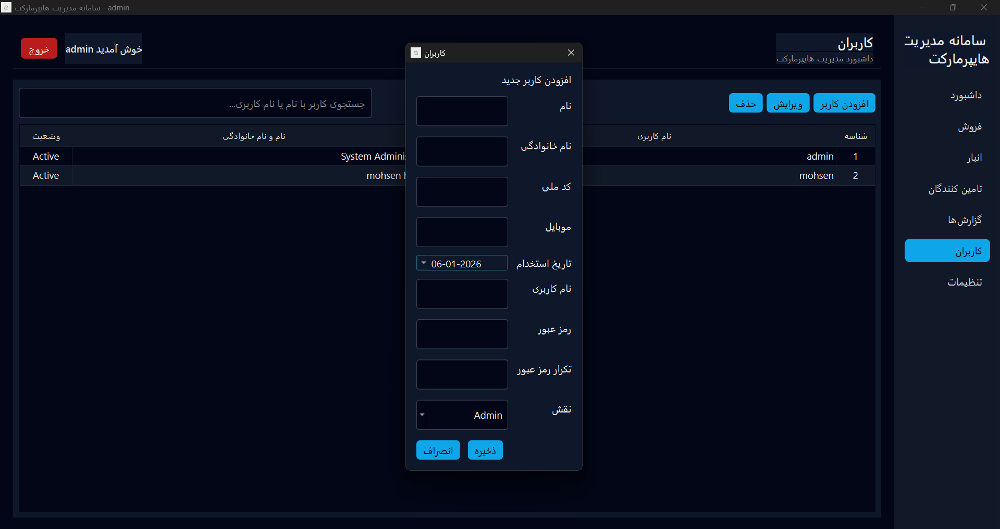

# راهنمای سامانه مدیریت هایپرمارکت

## فهرست مطالب
- [معرفی](#معرفی)
- [ورود به سیستم](#ورود-به-سیستم)
- [داشبورد](#داشبورد)
- [مدیریت انبار](#مدیریت-انبار)
- [مدیریت تامین‌کننده‌ها](#مدیریت-تامینکنندهها)
- [فروش](#فروش)
- [مشتریان](#مشتریان)
- [گزارش‌ها](#گزارشها)
- [کاربران](#کاربران)
- [تنظیمات](#تنظیمات)

---

## معرفی

سامانه مدیریت هایپرمارکت یک نرم‌افزار جامع برای مدیریت فروشگاه‌های بزرگ است که امکانات زیر را فراهم می‌کند:

- مدیریت موجودی و انبار
- سیستم فروش با پشتیبانی از بارکد
- مدیریت تامین‌کننده‌ها و مشتریان
- گزارش‌گیری پیشرفته
- پشتیبانی از دو زبان فارسی و انگلیسی
- سیستم امتیازدهی به مشتریان
- مدیریت کاربران و سطوح دسترسی

---

## ورود به سیستم

برای ورود به سیستم:
1. نام کاربری خود را وارد کنید
2. رمز عبور را وارد کنید
3. روی دکمه "ورود" کلیک کنید

**کاربر پیش‌فرض:**
- نام کاربری: `admin`
- رمز عبور: (رمز عبوری که هنگام نصب تنظیم کرده‌اید)

---

## داشبورد

داشبورد اطلاعات کلیدی را در یک نگاه به شما نشان می‌دهد:

### کارت‌های اطلاعاتی
- **فروش امروز**: مجموع فروش روز جاری
- **سود امروز**: سود خالص محاسبه شده امروز
- **سفارش‌های امروز**: تعداد تراکنش‌های فروش امروز
- **کالاهای رو به اتمام**: تعداد محصولاتی که به حداقل موجودی رسیده‌اند

### نمودار فروش روزانه
نمودار ستونی در قسمت پایین داشبورد، روند فروش را در طول روزهای مختلف نشان می‌دهد.

---

## مدیریت انبار

### مشاهده لیست محصولات

در این صفحه می‌توانید:
- لیست تمام محصولات را مشاهده کنید
- با استفاده از جستجو، محصول مورد نظر را پیدا کنید
- اطلاعات شامل: بارکد، دسته‌بندی، قیمت پایه، موجودی کل و حداقل موجودی

### افزودن محصول جدید

برای افزودن محصول جدید:

1. روی دکمه **"افزودن کالا"** کلیک کنید
2. فرم زیر را تکمیل کنید:

**اطلاعات اصلی:**
- **تأمین‌کننده**: از لیست کشویی تأمین‌کننده را انتخاب کنید
- **نام کالا**: نام محصول را وارد کنید
  - می‌توانید با کلیک روی آیکون جستجو، بر اساس بارکد نام اصلی کالا را دریافت کنید
- **بارکد**: بارکد محصول را وارد کنید
  - می‌توانید با کلیک روی آیکون دوربین، بارکد را اسکن کنید

**دسته‌بندی و قیمت:**
- **دسته‌بندی**: دسته محصول را انتخاب کنید (نوشیدنی، میان‌وعده و غیره)
- **قیمت پایه (ریال)**: قیمت خرید از تأمین‌کننده
  - با کلیک روی آیکون سبد خرید، قیمت واقعی و به روز محصول از سابت ترب دریافت میشود.
- **حداقل موجودی**: حد هشدار برای موجودی
- **واحد**: واحد اندازه‌گیری (عدد، کیلوگرم و غیره)

**اطلاعات موجودی:**
- **موجودی فعلی**: موجودی اولیه محصول
- **محصول فاسد شدنی است؟**: در صورت فاسد شدنی بودن تیک بزنید
- **موجودی اولیه**: تعداد اولیه برای ورود به انبار
- **قیمت خرید (ریال)**: قیمت خرید واقعی این محموله
- **تاریخ انقضاء (شمسی)**: تاریخ انقضای محصول (در صورت فاسد شدنی بودن)

3. روی **"انصراف"** یا **"ذخیره"** کلیک کنید

### عملیات روی محصولات

با کلیک راست روی هر محصول، منوی زیر ظاهر می‌شود:

- **کپی بارکد**: کپی کردن بارکد محصول
- **تولید بارکد**: ایجاد و چاپ برچسب بارکد
- **ویرایش کالا**: ویرایش اطلاعات محصول
- **حذف کالا**: حذف محصول از سیستم
- **افزودن موجودی**: افزایش موجودی انبار
- **ثبت ضایعات**: ثبت محصولات آسیب‌دیده یا فاسد شده

### گزارش کالاهای نزدیک به انقضاء

این گزارش محصولاتی را نشان می‌دهد که به تاریخ انقضاء نزدیک شده‌اند:

- می‌توانید بازه زمانی را تنظیم کنید (مثلاً 30 روز)
- روی **"بروزرسانی"** کلیک کنید تا لیست به‌روز شود
- اطلاعات شامل: نام کالا، بارکد، پیچ (شماره محموله)، موجودی، تاریخ انقضاء و روزهای باقی‌مانده
- می‌توانید گزارش را به صورت PDF خروجی بگیرید

### گزارش موجودی انبار

این گزارش اطلاعات کامل موجودی را نشان می‌دهد:

- **نام کالا**: نام محصول
- **بارکد**: شماره بارکد
- **دسته‌بندی**: دسته محصول
- **واحد**: واحد اندازه‌گیری
- **موجودی کل**: تعداد موجودی
- **میانگین قیمت خرید**: میانگین قیمت خرید محصول
- **ارزش کل**: ارزش کل موجودی (تعداد × قیمت میانگین)

می‌توانید گزارش را به فرمت **PDF** یا **Excel** خروجی بگیرید.

---

## مدیریت تامین‌کننده‌ها

### مشاهده لیست تامین‌کننده‌ها

در این صفحه می‌توانید:
- لیست تمام تامین‌کننده‌ها را مشاهده کنید
- جستجوی تامین‌کننده انجام دهید
- اطلاعات شامل: نام شرکت، نام مسئول و شماره تلفن

### افزودن تامین‌کننده جدید

برای افزودن تامین‌کننده:

 روی دکمه **"افزودن تامین‌کننده"** کلیک کنید و اطلاعات زیر را وارد کنید:
   - **نام شرکت**: نام شرکت تامین‌کننده
   - **نام مسئول فروش**: نام فرد مسئول
   - **تلفن**: شماره تماس
   - **ایمیل**: آدرس ایمیل
   - **شهر**: شهر محل شرکت
   - **آدرس**: آدرس کامل

 روی **"OK"** کلیک کنید برای ذخیره

---

## فروش

صفحه فروش امکانات زیر را فراهم می‌کند:

### افزودن محصول به سبد خرید

چند روش برای افزودن محصول وجود دارد:

1. **وارد کردن بارکد**: بارکد را در کادر جستجو وارد کنید و Enter بزنید
2. **اسکن بارکد**: روی دکمه **"اسکن بارکد"** کلیک کنید و بارکد را اسکن کنید
3. **جستجو**: روی دکمه **"جستجو"** کلیک کنید و محصول را از لیست انتخاب کنید

### مدیریت مشتری

- **انتخاب مشتری**: روی دکمه **"انتخاب مشتری"** کلیک کنید
- **امتیازات**: امتیاز مشتری و ارزش آن در بالا نمایش داده می‌شود
- مثال: `Loyalty Points: 1 (Value: 1000.00)`

### عملیات فروش

**دکمه‌های موجود:**
- **مرجوعی / استرداد**: بازگشت کالا از مشتری
- **حالت مرجوعی**: فعال کردن حالت مرجوعی
- **جستجو**: جستجوی محصول در لیست
- **اسکن بارکد**: اسکن بارکد محصولات

### جزئیات سبد خرید

جدول سبد خرید شامل:
- **نام کالا**: نام محصول
- **تعداد**: تعداد قابل تغییر با دکمه‌های + و -
- **قیمت**: قیمت واحد
- **جمع ردیف**: قیمت کل هر ردیف
- **حذف**: حذف محصول از سبد (دکمه X قرمز)

### تکمیل فروش

در پایین صفحه:
- **تخفیف**: وارد کردن مبلغ تخفیف
- **مجموع**: نمایش مبلغ کل خرید
- **دکمه‌های عملیات**:
  - **تسویه به**: موقت ذخیره کردن فاکتور
  - **فراخوانی فاکتور**: بازیابی فاکتورهای ذخیره شده
  - **نگه داشتن فاکتور**: ذخیره فاکتور فعلی
  - **حذف همه**: پاک کردن سبد خرید
  - **پشتن شیفت**: بستن شیفت کاری و گزارش‌گیری
  - **پرداخت**: نهایی کردن خرید

### اسکن بارکد

برای اسکن بارکد:
1. نوع دوربین را انتخاب کنید (داخلی یا DroidCam برای موبایل)
2. روی **"شروع دوربین"** کلیک کنید
3. بارکد را جلوی دوربین قرار دهید
4. سیستم به طور خودکار بارکد را شناسایی می‌کند

می‌توانید از **"بارگذاری تصویر"** برای آپلود تصویر بارکد نیز استفاده کنید.

### مرجوعی کالا

برای مرجوع کردن کالا:
1. شناسه فاکتور را در کادر **"Invoice ID"** وارد کنید
2. روی **"Load"** کلیک کنید
3. مشخصات فاکتور و محصولات نمایش داده می‌شود
4. تعداد مرجوعی و دلیل را برای هر محصول وارد کنید
5. مبلغ استرداد در پایین نمایش داده می‌شود
6. روی **"OK"** برای تأیید یا **"Cancel"** برای لغو کلیک کنید

---

## مشتریان

در این بخش می‌توانید:

### مشاهده و جستجو
- لیست تمام مشتریان را مشاهده کنید
- جستجو بر اساس نام یا شماره موبایل
- مشاهده کد اشتراک هر مشتری

### مدیریت مشتریان
- **افزودن**: افزودن مشتری جدید
- **ویرایش**: ویرایش اطلاعات مشتری
- **حذف**: حذف مشتری از سیستم

### انتخاب مشتری
- روی مشتری کلیک کنید و سپس **"انتخاب"** را بزنید
- یا روی **"انصراف"** برای بازگشت کلیک کنید

**اطلاعات مشتری شامل:**
- شناسه (ID)
- نام
- شماره موبایل
- کد اشتراک (برای امتیازدهی)

---

## گزارش‌ها

بخش گزارش‌ها اطلاعات تحلیلی کامل را ارائه می‌دهد:

### فیلترهای زمانی
- **از تاریخ**: تاریخ شروع بازه گزارش
- **تا تاریخ**: تاریخ پایان بازه گزارش
- روی **"تولید گزارش"** کلیک کنید

### آمار کلی
سه کارت اطلاعاتی در بالا نمایش داده می‌شود:
- **مجموع فروش**: مجموع کل فروش در بازه انتخابی
- **سود کل**: سود خالص محاسبه شده
- **تعداد تراکنش‌ها**: تعداد فاکتورهای صادر شده

### نمودار فروش روزانه
نمودار ستونی روند فروش را در طول روزهای مختلف نشان می‌دهد.

### جدول تراکنش‌ها
لیست تمام تراکنش‌های فروش شامل:
- **شناسه**: شماره فاکتور
- **تاریخ**: تاریخ و زمان فروش
- **مشتری**: نام مشتری
- **مبلغ کل**: مبلغ کل فاکتور
- **تخفیف**: مبلغ تخفیف داده شده

### خروجی گزارش
روی **"خروجی CSV"** کلیک کنید تا گزارش را به فرمت CSV دریافت کنید.

---

## کاربران

### مشاهده کاربران
لیست تمام کاربران سیستم با اطلاعات:
- **نام کاربری (Username)**
- **نقش (Role)**: مدیر سیستم، صندوقدار و غیره
- **نام و نام خانوادگی (Full Name)**
- **وضعیت (Status)**: فعال یا غیرفعال

### مدیریت کاربران
- **افزودن کاربر**: افزودن کاربر جدید
- **ویرایش**: ویرایش اطلاعات کاربر
- **حذف**: حذف کاربر از سیستم
- **جستجو**: جستجو بر اساس نام یا نام کاربری

### افزودن کاربر جدید

برای ایجاد کاربر جدید:

روی **"افزودن کاربر"** کلیک کنید و فرم زیر را تکمیل کنید:
   - **نام**: نام کاربر
   - **نام خانوادگی**: نام خانوادگی کاربر
   - **کد ملی**: کد ملی کاربر
   - **موبایل**: شماره تماس
   - **تاریخ استخدام**: تاریخ شروع به کار
   - **نام کاربری**: نام کاربری برای ورود به سیستم
   - **رمز عبور**: رمز عبور کاربر
   - **تکرار رمز عبور**: تأیید رمز عبور
   - **نقش**: نقش کاربر (Admin یا Cashier)

روی **"ذخیره"** کلیک کنید

**نکته**: کاربران با نقش "صندوقدار" فقط به بخش فروش دسترسی دارند.

**نکته**: کاربران با نقش "انباردار" فقط به بخش انبار دسترسی دارند.

---

## تنظیمات

تنظیمات به سه بخش اصلی تقسیم می‌شود:

### پروفایل کاربری

**اطلاعات شخصی:**
- نام
- نام خانوادگی
- موبایل
- کد ملی
- نام کاربری

روی **"ذخیره تغییرات"** کلیک کنید تا تغییرات اعمال شود.

**تغییر رمز عبور:**
- رمز عبور فعلی را وارد کنید
- رمز عبور جدید را وارد کنید
- رمز عبور جدید را تکرار کنید
- روی **"ذخیره رمز عبور"** کلیک کنید

### ظاهر و زبان

**تم برنامه:**
- انتخاب بین تم تیره (پیش‌فرض) یا تم روشن

**زبان برنامه:**
- **زبان برنامه**: انتخاب بین فارسی یا انگلیسی

**اطلاعات فروشگاه:**
- **نام فروشگاه**: نام هایپرمارکت
- **آدرس**: آدرس کامل فروشگاه
- **تلفن**: شماره تماس فروشگاه

روی **"ذخیره اطلاعات فروشگاه"** کلیک کنید.

### پایگاه داده

در بخش Database می‌توانید:
- **Backup**: پشتیبان‌گیری از پایگاه داده
- **Restore**: بازیابی پایگاه داده از فایل پشتیبان

**نکته مهم**: به صورت منظم از پایگاه داده پشتیبان بگیرید تا در صورت بروز مشکل بتوانید اطلاعات را بازیابی کنید.

---

## سوالات متداول

### چگونه محصول با موجودی کم را پیدا کنم؟
در داشبورد، کارت "کالاهای رو به اتمام" تعداد محصولاتی را نشان می‌دهد که به حداقل موجودی رسیده‌اند.

### چگونه می‌توانم فاکتور قبلی را مرجوع کنم؟
از صفحه فروش، روی **"مرجوعی / استرداد"** کلیک کنید و شماره فاکتور را وارد کنید.

### آیا می‌توانم چند فاکتور را همزمان نگه دارم؟
بله، با استفاده از دکمه **"نگه داشتن فاکتور"** می‌توانید فاکتورها را ذخیره کنید و بعداً با **"فراخوانی فاکتور"** آنها را بازیابی کنید.

### چگونه به مشتری امتیاز می‌دهم؟
با انتخاب مشتری در صفحه فروش، سیستم به طور خودکار بر اساس مبلغ خرید به او امتیاز می‌دهد.

### آیا می‌توانم گزارش‌ها را چاپ کنم؟
بله، تمام گزارش‌ها قابلیت خروجی به PDF یا Excel را دارند.

---

## پشتیبانی

در صورت بروز مشکل یا نیاز به راهنمایی بیشتر:
- با تیم توسعه در GitHub تماس بگیرید
- Issue جدیدی در مخزن پروژه ایجاد کنید

---

**نسخه راهنما:** 1.0  
**آخرین به‌روزرسانی:** 1404/10/16
